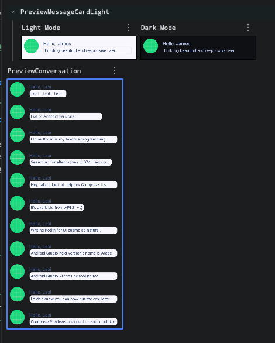

# Jetpack Compose Basics Refresher

This project is a simple Android application built to revisit and reinforce the fundamentals of
Jetpack Compose. It's designed for anyone looking for a quick refresher on the core concepts of
building UIs with Compose.

## Core Concepts Covered:

* **Defining composable functions:** Creating reusable UI components with `@Composable` functions.
* **Building layouts:** Using `Surface` and other layout composables to structure the UI.
* **Using Modifiers:** Customizing the appearance and behavior of composables.
* **State Management:** Working with state to create dynamic and interactive UIs.
* **Displaying Lists:** Creating efficient lists of items.
* **User Interaction:** Handling user input and events.
* **Animation:** Adding simple animations to enhance the user experience.

## Getting Started

The main entry point of the application is `MainActivity.kt`. It sets up the main screen with a
`MessageCard` composable.

```kotlin
class MainActivity : ComponentActivity() {
    override fun onCreate(savedInstanceState: Bundle?) {
        super.onCreate(savedInstanceState)
        setContent {
            ComposeGettingStartedTheme {
                Surface(modifier = Modifier.fillMaxSize()) {
                    MessageCard(msg = Message("Android", "Jetpack Compose"))
                }
            }
        }
    }
}
```

This project is a great starting point to experiment with different Composables and modifiers to get
comfortable with the Jetpack Compose framework.

### LazyColumn

The vertically scrolling list that only composes and lays out the currently visible items.


### Compose Essentials